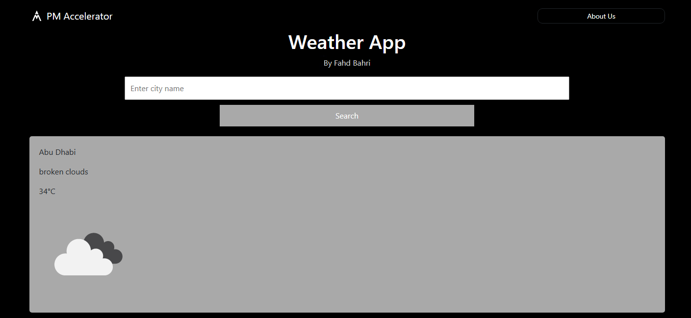
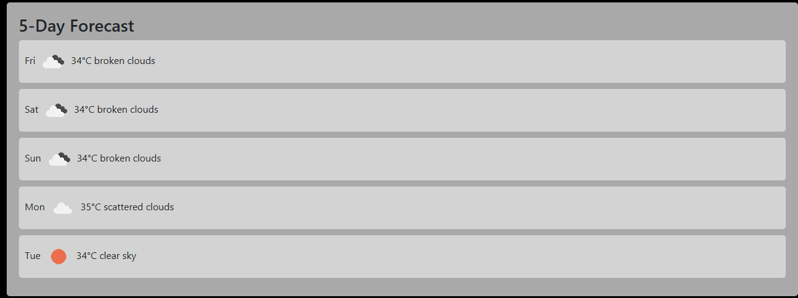

# Weather App

A simple weather application that provides current weather information and a 5-day forecast based on the user's location or a specified city. The app uses Flask on the backend and integrates Bootstrap for responsive design.


## Table of Contents
- [Demo](#demo)
- [Installation](#installation)
- [Usage](#usage)
- [Features](#features)
- [Future Enhancements](#future-enhancements)
- [Contributing](#contributing)
- [License](#license)
- [Contact Information](#contact-information)
- [Acknowledgments](#acknowledgments)

## Demo

### Screenshot 1


### Screenshot 2


## Prerequisites

- Python 3.7 or higher
- Flask 2.x

## Installation

1. Clone the repository:
    ```bash
    git clone https://github.com/fahdbahri/weather-app-flask.git
    ```
2. Navigate to the project directory:
    ```bash
    cd weather-app-flask
    ```
3. Create and activate a virtual environment:
    ```bash
    python -m venv venv
    source venv/bin/activate # On Windows use: venv\Scripts\activate
    ```
4. Install the required dependencies:
    ```bash
    pip install -r requirements.txt
    ```
5. Run the app:
    ```bash
    python app.py
    ```

## Usage

- After running `python app.py`, open your browser and go to `http://127.0.0.1:5000`.
- Enter a city name for the current weather and a 5-day forecast.
- Alternatively, you can allow location access to get the weather for your current location.

### Example:
1. Open the app and enter "New York".
2. Click "Get Weather" to view the current weather and 5-day forecast.

## Features

- Displays current weather and a 5-day forecast.
- Supports geolocation to fetch weather based on the user's location automatically.
- Responsive design using Bootstrap.
- Informational modal with company description.

## Future Enhancements

- Adding hourly weather updates.
- Integrating with other weather APIs for additional data sources.
- Enhancing the UI with animated weather icons.
- Providing weather alerts and notifications.

## Contributing

Contributions are welcome! Please follow these steps:

1. Fork the repository.
2. Create a new branch:
    ```bash
    git checkout -b feature-branch
    ```
3. Make your changes.
4. Commit your changes:
    ```bash
    git commit -m "Describe your changes"
    ```
5. Push to the branch:
    ```bash
    git push origin feature-branch
    ```
6. Open a pull request.

## License

This project is licensed under the MIT License. See the [LICENSE](LICENSE) file for details.

## Contact Information

- **Name:** Fahd Bahri
- **Email:** fahdkhalid2002@gmail.com
- **LinkedIn:** [Fahd Bahri](https://www.linkedin.com/in/fahdbahri/)

## Acknowledgments

- Icons from [FontAwesome](https://fontawesome.com).
- Weather data provided by [OpenWeatherMap](https://openweathermap.org).
